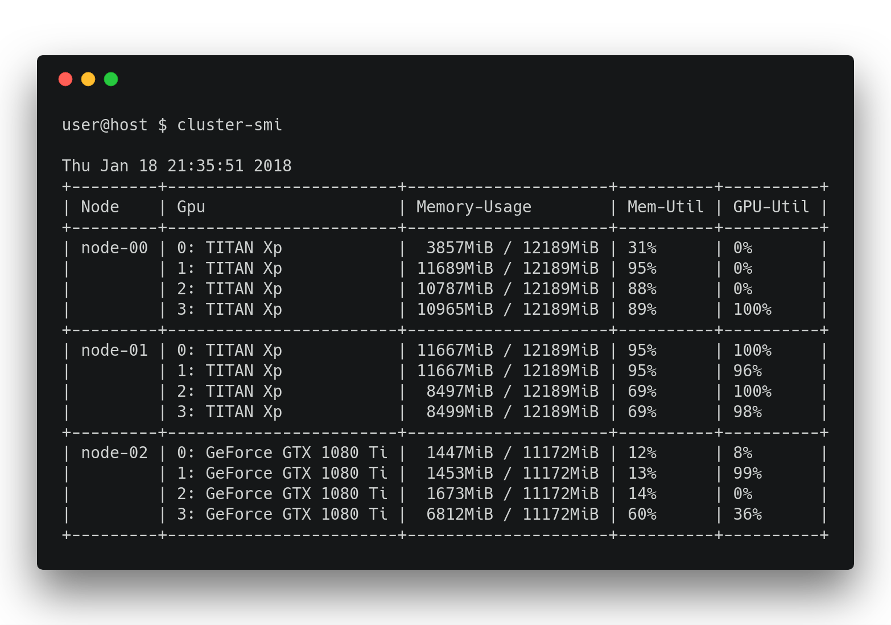

# CLUSTER-SMI
[](http://ci.patwie.com/PatWie/cluster-smi)

The same as `nvidia-smi` but for multiple machines.

Run `cluster-smi` and the output should be something like

<p align="center">  </p>

Additional information are available, when using

```console
user@host $ cluster-smi -h

Usage of cluster-smi:
  -n string
        match node-names with regex for display information (if not specified, all nodes will be shown) (default ".")
  -p	verbose process information
  -t	show time of events

```

## Monitoring Modes

This repository contains two versions: *cluster-smi-local*, *cluster-smi*.

### Local (cluster-smi-local)

*cluster-smi-local* is the same as *nvidia-smi* but provides more verbose process information with the flag `-p`:

```console

user@host $ cluster-smi-local -p

Thu Jan 18 21:44:51 2018
+---------------+-----------------------+-------------------------------+----------+-------+----------+---------------+-----------+-------------------------+
| Node          | Gpu                   | Memory-Usage                  | GPU-Util | PID   | User     | Command       | GPU Mem   | Runtime                 |
+---------------+-----------------------+-------------------------------+----------+-------+----------+---------------+-----------+-------------------------+
| node01        | 0:TITAN Xp            |  4477 MiB / 12189 MiB ( 36 %) |   39 %   |  5641 | john     | smokeparticle | 4465 MiB  |  1 d 21 h 58 min 19 sec |
|               | 1:TITAN Xp            |     0 MiB / 12189 MiB (  0 %) |    0 %   |       |          |               |           |                         |
|               | 2:TITAN Xp            |  4477 MiB / 12189 MiB ( 36 %) |   37 %   | 15963 | john     | smokeparticle | 4465 MiB  |  1 d 10 h 36 min 53 sec |
|               | 3:TITAN Xp            |  9930 MiB / 12189 MiB ( 81 %) |   94 %   | 10501 | john     | smokeparticle | 4465 MiB  |  1 d 19 h 30 min 27 sec |
|               |                       |                               |          | 10200 | jane     | caffe         | 5465 MiB  |  2 d 11 h 01 min  7 sec |
+---------------+-----------------------+-------------------------------+----------+-------+----------+---------------+-----------+-------------------------+

```

### Cluster (cluster-smi)

*cluster-smi* displays all information from *cluster-smi-local* but for **multiple** machines at the same time.

<p align="center">  </p>

On each machine you want to monitor you need to start *cluster-smi-node*. They are sending information from the nvidia-driver to a *cluster-smi-router*, which further distributes these information to client (*cluster-smi*) when requested. Only the machines running *cluster-smi-node* require CUDA dependencies.

You might be interested as well in [cluster-top](https://github.com/PatWie/cluster-top) for CPUS.

## Installation

All steps below are used to test possible changes to this codebase. See the [dockerfile](https://github.com/PatWie/cluster-smi/blob/master/.drone/Dockerfile) and [specific steps](https://github.com/PatWie/cluster-smi/blob/master/.drone.yml) to compile this project in the provided files used by CI.

### Requirements + Dependencies

- CUDA (just for `cluster-smi-node.go`)
- ZMQ (4.0.1)

Unfortunately, *ZMQ* can only be dynamically linked (`libzmq.so`) to this repository and you need to build it separately by

```bash
# compile ZMQ library for c++
cd /path/to/your_lib_folder
wget http:/files.patwie.com/mirror/zeromq-4.1.0-rc1.tar.gz
tar -xf zeromq-4.1.0-rc1.tar.gz
cd zeromq-4.1.0
./autogen.sh
./configure
./configure --prefix=/path/to/your_lib_folder/zeromq-4.1.0/dist
make
make install
```

Finally:

```
export PKG_CONFIG_PATH=/path/to/your_lib_folder/zeromq-4.1.0/dist/lib/pkgconfig/:$PKG_CONFIG_PATH
export LD_LIBRARY_PATH=$LD_LIBRARY_PATH:/path/to/your_lib_folder/zeromq-4.1.0/dist/lib
```

Edit the CFLAGS, LDFLAGS in file `nvvml/nvml.go` to match your setup.

### Compiling

You need to copy one config-file

```console
user@host $ cp config.example.go config.go
```

To obtain a portable small binary, I suggest to directly embed the configuration settings (ports, ip-addr) into the binary as compile-time constants. This way, the app is fully self-contained (excl. libzmq.so) and does not require any configuration-files. This can be done by editing `config.go`:

```go
...
c.RouterIp = "127.0.0.1"
c.Tick = 3
c.Timeout = 180
c.Ports.Nodes = "9080"
c.Ports.Clients = "9081"
...
```

Otherwise, you can specify the environment variable `CLUSTER_SMI_CONFIG_PATH` pointing to a yaml file (example in `cluster-smi.example.yml`).

Then run

```bash
git submodule update --init --recursive
cd proc
go install
cd ..
make all
```

Alternatively, you can use the following Docker-based build approach, in which [Docker](https://www.docker.com/) is used to create a clean environment for building cluster-smi, and actually building happens in the container.

```bash
git submodule update --init --recursive
cd docker
./build-docker-image.sh
cd ..
./build-cluster-smi-in-docker.sh
```

### Run

1. start `cluster-smi-node` at different machines having GPUs
2. start `cluster-smi-router` at a specific machine (machine with ip-addr: `cluster_smi_router_ip`)
3. use `cluster-smi` like `nvidia-smi`

Make sure, the machines can communicate using the specifiec ports (e.g., `ufw allow 9080, 9081`)

### Use systemd

To ease the use of this app, I suggest to add the *cluster-smi-node* into a systemd-service. An example config file can be found <a href="./docs/cluster-smi-node.example.service">here</a>. The steps would be

```bash
# add new entry to systemd
sudo cp docs/cluster-smi-node.example.service /etc/systemd/system/cluster-smi-node.service
# edit the path to cluster-smi-node
sudo nano /etc/systemd/system/cluster-smi-node.service
# make sure you can start and stop the service (have a look at you cluster-smi client)
sudo service cluster-smi-node start
sudo service cluster-smi-node stop
# register cluster-smi-node to start on reboots
sudo systemctl enable cluster-smi-node.service

# last, start the service
sudo service cluster-smi-node start
```

## Show all information

```console

user@host $ cluster-smi -p -t

Thu Jan 18 21:44:51 2018
+---------------+-----------------------+-------------------------------+----------+-------+----------+---------------+-----------+-------------------------+--------------------------+
| Node          | Gpu                   | Memory-Usage                  | GPU-Util | PID   | User     | Command       | GPU Mem   | Runtime                 | Last Seen                |
+---------------+-----------------------+-------------------------------+----------+-------+----------+---------------+-----------+-------------------------+--------------------------+
| node00        | 0:TITAN Xp            |     0 MiB / 12189 MiB (  0 %) |    0 %   |       |          |               |           |                         | Thu Jan 18 21:44:49 2018 |
|               | 1:TITAN Xp            |     0 MiB / 12189 MiB (  0 %) |    0 %   |       |          |               |           |                         |                          |
|               | 2:TITAN Xp            |     0 MiB / 12189 MiB (  0 %) |    0 %   |       |          |               |           |                         |                          |
|               | 3:TITAN Xp            |     0 MiB / 12189 MiB (  0 %) |    0 %   |       |          |               |           |                         |                          |
+---------------+-----------------------+-------------------------------+----------+-------+----------+---------------+-----------+-------------------------+--------------------------+
| node01        | 0:TITAN Xp            |  4477 MiB / 12189 MiB ( 36 %) |   39 %   |  5641 | john     | smokeparticle | 4465 MiB  |  1 d 21 h 58 min 19 sec | Thu Jan 18 21:44:50 2018 |
|               | 1:TITAN Xp            |     0 MiB / 12189 MiB (  0 %) |    0 %   |       |          |               |           |                         |                          |
|               | 2:TITAN Xp            |  4477 MiB / 12189 MiB ( 36 %) |   37 %   | 15963 | john     | smokeparticle | 4465 MiB  |  1 d 10 h 36 min 53 sec |                          |
|               | 3:TITAN Xp            |  9930 MiB / 12189 MiB ( 81 %) |   94 %   | 10501 | john     | smokeparticle | 4465 MiB  |  1 d 19 h 30 min 27 sec |                          |
|               |                       |                               |          | 10200 | jane     | caffe         | 5465 MiB  |  2 d 11 h 01 min  7 sec |                          |
+---------------+-----------------------+-------------------------------+----------+-------+----------+---------------+-----------+-------------------------+--------------------------+
| node02        | 0:GeForce GTX 1080 Ti |  9352 MiB / 11172 MiB ( 83 %) |   61 %   |  9368 | doe      | python        | 2325 MiB  |  9 h 52 min  9 sec      | Thu Jan 18 21:44:49 2018 |
|               |                       |                               |          |  9434 | doe      | python        | 2339 MiB  |  9 h 51 min 48 sec      |                          |
|               |                       |                               |          |  9461 | doe      | python        | 2339 MiB  |  9 h 51 min 40 sec      |                          |
|               |                       |                               |          |  9503 | doe      | python        | 2339 MiB  |  9 h 51 min 31 sec      |                          |
|               | 1:GeForce GTX 1080 Ti |  9352 MiB / 11172 MiB ( 83 %) |   34 %   |  9621 | doe      | python        | 2339 MiB  |  9 h 49 min 13 sec      |                          |
|               |                       |                               |          |  9644 | doe      | python        | 2325 MiB  |  9 h 49 min  7 sec      |                          |
|               |                       |                               |          |  9670 | doe      | python        | 2339 MiB  |  9 h 49 min  1 sec      |                          |
|               |                       |                               |          |  9751 | doe      | python        | 2339 MiB  |  9 h 48 min 51 sec      |                          |
|               | 2:GeForce GTX 1080 Ti |  9366 MiB / 11172 MiB ( 83 %) |   15 %   |  9857 | doe      | python        | 2339 MiB  |  9 h 47 min 44 sec      |                          |
|               |                       |                               |          |  9868 | doe      | python        | 2339 MiB  |  9 h 47 min 37 sec      |                          |
|               |                       |                               |          |  9911 | doe      | python        | 2339 MiB  |  9 h 47 min 27 sec      |                          |
|               |                       |                               |          |  9983 | doe      | python        | 2339 MiB  |  9 h 47 min 19 sec      |                          |
|               | 3:GeForce GTX 1080 Ti |  9340 MiB / 11172 MiB ( 83 %) |   33 %   | 10144 | doe      | python        | 2325 MiB  |  9 h 43 min 30 sec      |                          |
|               |                       |                               |          | 10168 | doe      | python        | 2339 MiB  |  9 h 43 min 23 sec      |                          |
|               |                       |                               |          | 10192 | doe      | python        | 2339 MiB  |  9 h 43 min 17 sec      |                          |
|               |                       |                               |          | 10220 | doe      | python        | 2327 MiB  |  9 h 43 min 10 sec      |                          |
+---------------+-----------------------+-------------------------------+----------+-------+----------+---------------+-----------+-------------------------+--------------------------+

```


Explanation:

For flag `-p`
- *Node* is hostname of the machine
- *Gpu* lists all devices
- *Memory-Usage* lists used GPU memory
- *Gpu-Util* current GPU utilization
- *PID* process id of processes with active cuda context
- *User* owner (username) of PID
- *Command* command which is running
- *Command* command which is running
- *GPU Mem* use memory for only that particular process
- *Runtime* total time the process is already running

For flag `-t`
- *Last Seen* timestamp of last message of the machine status

For flag `-n`
- filter all nodes and only show those matching the given regEx

For flag `-u`
- filter all information and only show those related to given user

If the last message is older than 3 minutes, this list will print a "Timeout/Offline" in this line. Make sure the machine is running. Any new message will remove this note.
