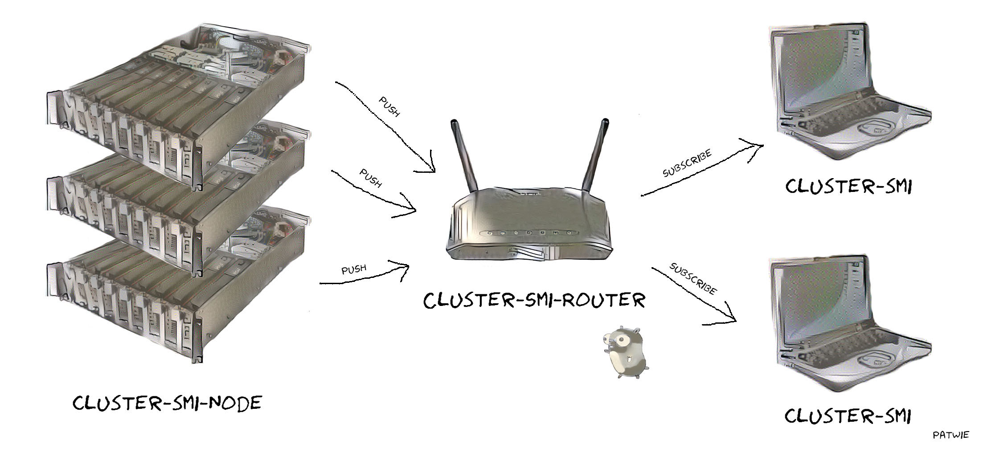

# CLUSTER-SMI

The same as `nvidia-smi` but for multiple machines at the same time.

<p align="center">  </p>


Output should be something like

```
+---------+------------------------+---------------------+----------+----------+
| Node    | Gpu                    | Memory-Usage        | Mem-Util | GPU-Util |
+---------+------------------------+---------------------+----------+----------+
| node-00 | 0: TITAN Xp            |  3857MiB / 12189MiB | 31%      | 0%       |
|         | 1: TITAN Xp            | 11689MiB / 12189MiB | 95%      | 0%       |
|         | 2: TITAN Xp            | 10787MiB / 12189MiB | 88%      | 0%       |
|         | 3: TITAN Xp            | 10965MiB / 12189MiB | 89%      | 100%     |
+---------+------------------------+---------------------+----------+----------+
| node-01 | 0: TITAN Xp            | 11667MiB / 12189MiB | 95%      | 100%     |
|         | 1: TITAN Xp            | 11667MiB / 12189MiB | 95%      | 96%      |
|         | 2: TITAN Xp            |  8497MiB / 12189MiB | 69%      | 100%     |
|         | 3: TITAN Xp            |  8499MiB / 12189MiB | 69%      | 98%      |
+---------+------------------------+---------------------+----------+----------+
| node-02 | 0: GeForce GTX 1080 Ti |  1447MiB / 11172MiB | 12%      | 8%       |
|         | 1: GeForce GTX 1080 Ti |  1453MiB / 11172MiB | 13%      | 99%      |
|         | 2: GeForce GTX 1080 Ti |  1673MiB / 11172MiB | 14%      | 0%       |
|         | 3: GeForce GTX 1080 Ti |  6812MiB / 11172MiB | 60%      | 36%      |
+---------+------------------------+---------------------+----------+----------+
```

Each machine you want to monitor need to start *cluster-smi-node* (e.g. using systemd). They are sending the information to a *cluster-smi-server*, which further distribute these information to client (*cluster-smi*). Only the machines running *cluster-smi-node* require CUDA dependencies.

## Install

### Requirements+Dependencies

I assume you can compile a CUDA program, as the `cluster-smi-node` depends on the NVIDIA driver to get the metrics.


Dependencies are *MsgPack* for serialization and *ZMQ* (tested with 4.0.1) for messaging. Unfortunately, *ZMQ* can only be dynamically linked (`libzmq.so`) to this repository and you need to build it separately by
```bash
# compile ZMQ library for c++
cd /path/to/your_lib_folder
wget https://archive.org/download/zeromq_4.1.0/zeromq-4.1.0-rc1.tar.gz
tar -xf zeromq-4.1.0-rc1.tar.gz
cd zeromq-4.1.0
./autogen.sh
./configure
./configure --prefix=/path/to/your_lib_folder/zeromq-4.1.0/dist
make
make install
```

Finally:

```
export PKG_CONFIG_PATH=/path/to/your_lib_folder/zeromq-4.1.0/dist/lib/pkgconfig/:$PKG_CONFIG_PATH
```

Edit the CFLAGS, LDFLAGS in file `nvvml/nvml.go` to match your setup.

### Compiling

To obtain a portable small binary, we directly embed the configuration settings (ports, ip-addr) into the binary as compile-time constants from `cluster-smi.env` (example is given in `cluster-smi.example.env`). This way, the app is fully self-contained (excl. libzmq.so) and does not require any configuration-files.

```nginx
# file: cluster-smi.env

# ip of cluster-smi-server
cluster_smi_server_ip="127.0.0.1"
# port of cluster-smi-server, which nodes send to
cluster_smi_server_port_gather="9080"
# port of cluster-smi-server, where clients subscribe to
cluster_smi_server_port_distribute="9081"
# tick for receiving data in milliseconds
cluster_smi_tick_ms="1000"
```

Then run

```bash
make all
```


## Run

1. start `cluster-smi-node` at different machines having GPUs
2. start `cluster-smi-server` at a specific machine (machine with ip-addr: `cluster_smi_server_ip`)
3. use `cluster-smi` like `nvidia-smi`

Make sure, the machines can communicate using the specifiec ports (e.g., `ufw allow 9080, 9081`)
